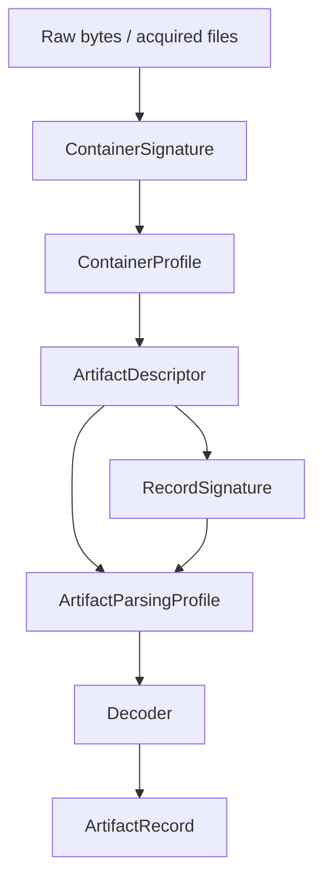

# Architecture

forensicnomicon is a **forensic catalog crate** — a zero-dependency, `no_std`-compatible Rust library that compiles all artifact knowledge into `static`/`const` memory. There is no runtime I/O, no database, and no heap allocation in the indicator and catalog layers.

---

## Module map

### Artifact catalog

```
src/catalog/          — 6,548-entry ArtifactDescriptor registry
src/lib.rs            — crate root, module re-exports, crate-level docs
```

The `CATALOG` global provides the primary query API: by MITRE technique, triage priority, keyword, OS scope, and structured filter. 361 entries are fully hand-curated; 6,187 are generated from seven upstream corpora by `crates/ingest`.

### Indicator tables (flat, no_std-safe)

These modules export only `&'static` slices and Boolean lookup functions. They carry zero runtime allocation and are safe to use in `no_std` environments.

| Module | What it covers | Upstream sources |
|--------|---------------|-----------------|
| `lolbins` | All six LOL/LOFL datasets — see below | LOLBAS Project, LOFL Project, GTFOBins, LOOBins, macOS LOFL catalog |
| `abusable_sites` | Trusted domains abused for C2/phishing/exfil; `AbusableSite` derives `serde::Serialize` under the `serde` feature | LOTS Project, URLhaus / abuse.ch |
| `ports` | Suspicious TCP/UDP ports (C2 frameworks, Tor, WinRM) | SANS ISC, Cobalt Strike docs, Tor Project, Microsoft |
| `persistence` | Run keys, cron paths, LaunchAgent directories | MITRE ATT&CK, Harlan Carvey, Sysinternals Autoruns |
| `processes` | Masquerade targets, malware process names, LSASS tools | MITRE ATT&CK T1036/T1003, Elastic Security Labs |
| `commands` | Reverse shells, PowerShell abuse, download cradles, WMI abuse | PayloadsAllTheThings, Red Canary, MITRE ATT&CK |
| `antiforensics` | Log-wipe commands, timestomp indicators, rootkit names | MITRE ATT&CK T1070, Elastic Security Labs, Sandfly Security |
| `remote_access` | LOLRMM / RMM registry indicators per tool | LOLRMM Project (<https://lolrmm.io/>), CISA AA23-025A |
| `paths` | Suspicious staging and DLL hijack paths | MITRE ATT&CK, community research |
| `encryption` | BitLocker, EFS, VeraCrypt, archive tool paths | tool documentation |
| `third_party` | PuTTY, WinSCP, cloud sync, browser registry artifacts | tool documentation |
| `pca` | Windows 11 Program Compatibility Assistant artifacts | Microsoft documentation |
| `references` | Queryable source map per module | (internal) |
| `no_std_compat` | Documents and validates the `no_std`-safe API surface | (internal) |

### Enrichment modules

These modules add forensic context on top of raw indicator data.

| Module | Enrichment layer |
|--------|----------------|
| `evidence` | Evidence strength ratings with analyst caveats |
| `volatility` | RFC 3227 Order of Volatility per artifact |
| `temporal` | Temporal correlation hints for timeline analysis |
| `antiforensics_aware` | Per-artifact anti-forensic tampering risk model |
| `version_history` | Artifact format / location changes across OS versions |
| `dependencies` | Artifact dependency graph for collection planning |
| `playbooks` | Six directed investigation paths |
| `mitre` | Shared `AttackTechnique` type; YARA rule name prefix lookup |
| `attack_flow` | Campaign graph layer: 5 pre-built adversary scenarios |
| `sigma` | Sigma rule cross-references per artifact |
| `chainsaw` | Chainsaw / Hayabusa hunt rule references |
| `navigator` | ATT&CK Navigator JSON layer generator |
| `yara` | YARA rule skeleton generator |
| `stix` | STIX 2.1 observable mappings |
| `eventids` | Windows Event ID enrichment |
| `forensicartifacts` | ForensicArtifacts.com YAML interop |
| `toolchain` | KAPE targets / Velociraptor artifact mappings |
| `plugin` | Runtime decoder plugin architecture |

---

## LOL / LOFL taxonomy

### Definitions

**LOL (Living Off the Land):** Abuse of binaries, scripts, and libraries that ship with the operating system. The LOLBAS Project catalogues Windows LOL binaries; GTFOBins catalogues Linux; the LOOBins project catalogues macOS.

**LOFL (Living Off Foreign Land):** Abuse of *third-party* admin tools that are commonly deployed on enterprise endpoints — cloud CLIs, container runtimes, language runtimes, Sysinternals tools, etc. The LOFL Project catalogues Windows tools. This crate adds the first published macOS LOFL catalog (`research/macos-lofl-catalog.yaml`).

### Why they are unified

From a detection standpoint the distinction is academic: LOL and LOFL binaries appear identically in process telemetry, Prefetch, AmCache, and EDR alerts. Defenders cannot treat them differently at triage time. This is why GTFOBins already unifies both for Linux, and why forensicnomicon unifies both for all three platforms.

### The six constants and their artifact sources

All six constants are `&[LolbasEntry]`. Every entry in the slice carries a `name`, `mitre_techniques`, `use_cases` bitmask, and `description`.

| Constant | Binary type | Where it shows up in logs |
|----------|-------------|--------------------------|
| `LOLBAS_WINDOWS` | `.exe`, `.vbs`, `.cmd` | Process telemetry, Sysmon, Prefetch, AmCache |
| `LOLBAS_LINUX` | no extension | `auditd execve`, eBPF, EDR |
| `LOLBAS_MACOS` | no extension | macOS Endpoint Security Framework, Unified Log |
| `LOLBAS_WINDOWS_CMDLETS` | PowerShell cmdlet name or alias | ScriptBlock log (Event 4104), PSReadLine history, AMSI |
| `LOLBAS_WINDOWS_MMC` | `.msc` file | LNK files, UserAssist MRU, Jump Lists |
| `LOLBAS_WINDOWS_WMI` | WMI class name | WMI Activity log (Event 5861), `Get-CimInstance` calls |

### `LolbasEntry` data model

```rust
pub struct LolbasEntry {
    pub name: &'static str,                        // canonical name, e.g. "certutil.exe"
    pub mitre_techniques: &'static [&'static str], // ATT&CK technique IDs
    pub use_cases: u16,                            // OR-ed UC_* bitmask
    pub description: &'static str,                // one-line forensic significance
}
```

Use `lolbas_entry(catalog, name) -> Option<&LolbasEntry>` for case-insensitive name lookup, and `lolbas_names(catalog) -> impl Iterator<Item=&'static str>` to iterate names.

### `UC_*` use-case bitmask constants

| Constant | Bit | Abuse use-case |
|----------|-----|----------------|
| `UC_EXECUTE` | 0 | Arbitrary code or binary execution |
| `UC_DOWNLOAD` | 1 | Fetch files from the network |
| `UC_UPLOAD` | 2 | Exfiltrate or send data out |
| `UC_BYPASS` | 3 | Security control bypass (UAC, AMSI, AWL) |
| `UC_PERSIST` | 4 | Establish persistence |
| `UC_RECON` | 5 | Discovery and enumeration |
| `UC_PROXY` | 6 | Proxy execution of another payload |
| `UC_DECODE` | 7 | Decode or deobfuscate data |
| `UC_ARCHIVE` | 8 | Compress or expand archives |
| `UC_CREDENTIALS` | 9 | Credential access or manipulation |
| `UC_NETWORK` | 10 | Network configuration or lateral movement |
| `UC_DEFENSE_EVASION` | 11 | Log clearing, AV disable, etc. |

### Upstream data sources

All five community upstreams meet the formal **upstream policy** (see below). Each has a dedicated fetch script in `scripts/` that writes JSON to `archive/sources/`.

| Dataset | Constant(s) | Fetch script | Source |
|---------|-------------|-------------|--------|
| LOLBAS Project | `LOLBAS_WINDOWS` | `scripts/fetch_lolbas.py` | LOLBAS Project — community-maintained Windows LOLBin catalog. JSON API: <https://lolbas-project.github.io/api/lolbas.json>. GitHub: <https://github.com/LOLBAS-Project/LOLBAS> |
| LOFL Project | `LOLBAS_WINDOWS` (foreign-land subset), `LOLBAS_WINDOWS_CMDLETS`, `LOLBAS_WINDOWS_MMC`, `LOLBAS_WINDOWS_WMI` | `scripts/fetch_lofl.py` | LOFL Project — Living Off Foreign Land; Windows admin / third-party tool abuse. <https://lofl-project.github.io/>. GitHub: <https://github.com/lofl-project/lofl-project.github.io> |
| GTFOBins | `LOLBAS_LINUX` | `scripts/fetch_gtfobins.py` | GTFOBins — Unix/Linux binary escape and bypass catalog. <https://gtfobins.github.io/>. GitHub: <https://github.com/GTFOBins/GTFOBins.github.io>. 479 entries as of 2025-Q4 |
| LOOBins + macOS LOFL | `LOLBAS_MACOS` | `scripts/fetch_loobins.py` + research file | **macOS native (LOL):** LOOBins — <https://www.loobins.io/> · GitHub: <https://github.com/infosecB/LOOBins>. **macOS foreign-land (LOFL):** first published catalog — `research/macos-lofl-catalog.yaml`, 78 tools |
| LOTS Project | `ABUSABLE_SITES` | `scripts/fetch_lots.py` | LOTS Project — Living Off Trusted Sites; cloud/CDN domains abused for C2/phishing/exfil. <https://lots-project.com/>. 175+ entries. GitHub: <https://github.com/SigmaHQ/lots-project> |

### Upstream policy

An external dataset qualifies as a **formal upstream** — with its own fetch script and citation trail — when it satisfies all four criteria:

1. **Maintained:** Active commits / community contributions within the past 12 months.
2. **Authoritative:** Curated by security researchers with peer review (PR process, issue tracker, academic or practitioner citation history).
3. **Machine-Readable:** Stable, parseable format (JSON API, YAML files, HTML table with consistent structure).
4. **Additive:** Entries that land in the upstream are a superset of, or complementary to, entries already in forensicnomicon — no contradictions or quality degradation.

Upstreams are registered in `archive/sources/source-inventory.json` with `"update_strategy": "fetch"`. The fetch script writes to `archive/sources/<upstream>.json`; a human promotion step is required before entries enter the static Rust catalog.

---

## Abusable sites taxonomy

The `abusable_sites` module models domains along two orthogonal dimensions:

1. **`SiteCategory`** — the legitimate function of the domain (code repository, CDN, messaging, paste service, etc.). This explains *why* it is trusted and therefore hard to block.

2. **`BlockingRisk`** — the organisational cost of a blanket block. Attackers choose `Critical`-risk domains (GitHub, AWS, Google Drive) deliberately because defenders cannot block them without disrupting their own operations.

Abuse behaviour is encoded as a composable `u8` bitfield of `TAG_*` constants:

| Tag | ATT&CK technique |
|-----|-----------------|
| `TAG_PHISHING` | T1566.002 |
| `TAG_C2` | T1102 |
| `TAG_DOWNLOAD` | T1105 |
| `TAG_EXFIL` | T1567 |
| `TAG_EXPLOIT` | (various) |

Data sources:
- [LOTS Project](https://lots-project.com/) (GitHub: [SigmaHQ/lots-project](https://github.com/SigmaHQ/lots-project)) — primary upstream; 175 entries; fetched by `scripts/fetch_lots.py`
- [URLhaus / abuse.ch](https://urlhaus.abuse.ch/) — active malware URL feed; synced by `scripts/sync_urlhaus.py`

---

## Data-flow: raw bytes to ArtifactRecord



All layers are queryable via `CATALOG`:

```rust
use forensicnomicon::catalog::CATALOG;
let cp = CATALOG.container_profile("windows_registry_hive");
let pp = CATALOG.parsing_profile("userassist_exe");
let rs = CATALOG.record_signatures("userassist_exe");
```

---

## Scope boundary

This crate is a **forensic catalog**, not a full DFIR parsing engine.

**In-scope (in-core decoders):** Compact, stable encodings intrinsic to the artifact model — `UserAssist` ROT13, `FILETIME` normalisation, `MRUListEx` ordering, `REG_MULTI_SZ` splitting, PCA record layouts.

**Out-of-scope:** Large or evolving formats — `hiberfil.sys`, full WMI repository parsing, BITS job stores. These belong in separate companion crates so this crate stays zero-dependency and `no_std`-compatible.

---

## The `research/` directory

`research/` is a data contribution area distinct from the compiled library:

| File | Contents |
|------|----------|
| `research/macos-lofl-catalog.yaml` | First published macOS LOFL catalog — 78 tools, documented abuse techniques, ATT&CK IDs |
| `research/attack-flows/` | CTID Attack Flow corpus (35 flows from the CTID AF corpus) |

The macOS LOFL YAML is the canonical source for the macOS LOFL section of `LOLBAS_MACOS`. If entries are added to the YAML they should be reflected in `src/lolbins.rs`.

---

## Build pipeline

`crates/ingest` — refreshes the 6,187 generated `ArtifactDescriptor` entries from upstream corpora:

```bash
cargo run -p ingest -- --source all --output src/catalog/descriptors/generated/
```

Sources: KAPE targets, ForensicArtifacts YAML, EVTX/ETW channel list, Velociraptor artifact YAML, RECmd batch files, browser paths, NirSoft tool list.

`crates/fcatalog` — the `fnomicon` CLI binary for interactive catalog exploration.

`crates/4n6query` (package: `forensicnomicon-cli`) — the `4n6query` DFIR query binary. Looks up LOL/LOFL entries across all six catalogs, abusable sites, and dumps machine-readable JSON/YAML snapshots for SIEM/SOAR integration. Requires the `serde` feature of the library crate (declared in its `Cargo.toml`). Supported subcommands:

```
4n6query lolbas lookup <platform> <name> [--format json|yaml]
4n6query sites lookup <domain>           [--format json|yaml]
4n6query dump --format json|yaml         [--dataset all|lolbas|sites]
```

Platforms: `windows`, `linux`, `macos`, `windows-cmdlet`, `windows-mmc`, `windows-wmi`.
