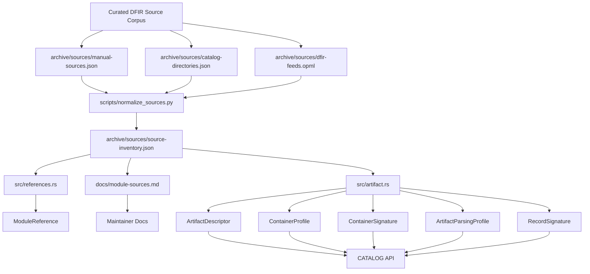
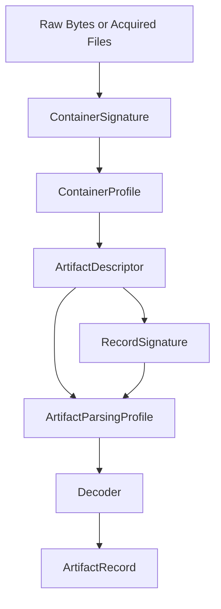

[](https://crates.io/crates/forensic-catalog)
[](https://docs.rs/forensic-catalog)
[](https://github.com/SecurityRonin/forensic-catalog/actions/workflows/ci.yml)
[](LICENSE)
[](https://www.rust-lang.org)

# forensic-catalog

Forensic knowledge as code — zero-dependency, `std`-only, embeds in any Rust binary.

## Docs

| | |
|---|---|
| [DFIR Handbook](https://securityronin.github.io/forensic-catalog/forensic_catalog/handbook/) | Analyst-facing artifact guide, investigation paths, carving guidance |
| [API Reference](https://docs.rs/forensic-catalog) | Full rustdoc — all structs, enums, and functions |
| [Architecture Diagram](https://securityronin.github.io/forensic-catalog/architecture.html) | Data-flow diagram: raw bytes → ArtifactRecord |
| [Module Source Map](docs/module-sources.md) | Per-module authoritative reference list |
| [Source Inventory](archive/sources/source-inventory.md) | Normalized DFIR source corpus |

## Quick start

```toml
[dependencies]
forensic-catalog = "0.1"
```

```rust
use forensic_catalog::ports::is_suspicious_port;
use forensic_catalog::catalog::{CATALOG, TriagePriority};

// Instant port check — no allocations
assert!(is_suspicious_port(4444)); // Metasploit default

// Pull every Critical-priority artifact, sorted for triage
let critical: Vec<_> = CATALOG
    .for_triage()
    .into_iter()
    .filter(|d| d.triage_priority == TriagePriority::Critical)
    .collect();
```

## What's inside

| Module | Covers | Key function / constant |
|---|---|---|
| `ports` | C2 ports, Cobalt Strike, Tor, WinRM, RAT defaults | `is_suspicious_port(port)` |
| `lolbins` | Windows + Linux LOLBins | `WINDOWS_LOLBINS`, `LINUX_LOLBINS` |
| `processes` | Known malware process names | `MALWARE_PROCESS_NAMES` |
| `commands` | Reverse shells, PowerShell abuse, download cradles | pattern slices |
| `paths` | Suspicious filesystem paths | path slices |
| `persistence` | Windows Run keys, Linux cron/init, macOS LaunchAgents | `WINDOWS_RUN_KEYS`, `LINUX_PERSISTENCE_PATHS`, `MACOS_PERSISTENCE_PATHS` |
| `catalog` | 150+ `ArtifactDescriptor`s with MITRE ATT&CK, triage priority, decode logic | `CATALOG` |
| `antiforensics` | Anti-forensics indicator paths and patterns | indicator slices |
| `encryption` | FDE artifact paths, credential store locations | path slices |
| `remote_access` | Remote access tool indicators (RMM, RAT, VPN) | indicator slices |
| `third_party` | OneDrive, PuTTY, and other third-party app artifact paths | path slices |
| `pca` | Windows Program Compatibility Assistant artifacts | path / key constants |
| `references` | Queryable authoritative source map for each public module | `module_references(name)` |

## The `ForensicCatalog` API

The `catalog` module is the power feature. Every artifact descriptor is a `const`-constructible `ArtifactDescriptor` — MITRE ATT&CK tags, triage priority, retention period, cross-correlation links, and embedded decode logic all in one static struct. No I/O, no allocation until you query.

### Query by MITRE technique

```rust
use forensic_catalog::catalog::CATALOG;

// All artifacts relevant to process injection
let artifacts = CATALOG.by_mitre("T1055");
for d in &artifacts {
    println!("{} — {}", d.id, d.meaning);
}
```

### Triage-ordered collection list

```rust
let ordered = CATALOG.for_triage(); // Critical → High → Medium → Low
for d in ordered.iter().take(10) {
    println!("[{:?}] {} — {}", d.triage_priority, d.id, d.name);
}
```

### Keyword search

```rust
let hits = CATALOG.filter_by_keyword("prefetch");
// matches on name or meaning, case-insensitive
```

### Structured filter

```rust
use forensic_catalog::catalog::{ArtifactQuery, DataScope, HiveTarget};

let hits = CATALOG.filter(&ArtifactQuery {
    scope: Some(DataScope::User),
    hive: Some(HiveTarget::NtUser),
    ..Default::default()
});
```

### Decode raw artifact data

```rust
use forensic_catalog::catalog::CATALOG;

let descriptor = CATALOG.by_id("userassist_exe").unwrap();
let record = CATALOG.decode(descriptor, value_name, raw_bytes)?;
// record.fields — decoded field name/value pairs
// record.timestamp — ISO 8601 UTC string, if present
// record.mitre_techniques — inherited from the descriptor
```

<details>
<summary>ArtifactDescriptor fields</summary>

| Field | Type | Description |
|---|---|---|
| `id` | `&'static str` | Machine-readable identifier (e.g. `"userassist"`) |
| `name` | `&'static str` | Human-readable display name |
| `artifact_type` | `ArtifactType` | `RegistryKey`, `RegistryValue`, `File`, `Directory`, `EventLog`, `MemoryRegion` |
| `hive` | `Option<HiveTarget>` | Registry hive, or `None` for file/memory artifacts |
| `key_path` | `&'static str` | Path relative to hive root |
| `scope` | `DataScope` | `User`, `System`, `Network`, `Mixed` |
| `os_scope` | `OsScope` | `Win10Plus`, `Linux`, `LinuxSystemd`, etc. |
| `decoder` | `Decoder` | `Identity`, `Rot13Name`, `FiletimeAt`, `BinaryRecord`, `Utf16Le`, … |
| `meaning` | `&'static str` | Forensic significance |
| `mitre_techniques` | `&'static [&'static str]` | ATT&CK technique IDs |
| `fields` | `&'static [FieldSchema]` | Decoded output field schema |
| `retention` | `Option<&'static str>` | How long artifact typically persists |
| `triage_priority` | `TriagePriority` | `Critical` / `High` / `Medium` / `Low` |
| `related_artifacts` | `&'static [&'static str]` | Cross-correlation artifact IDs |
| `sources` | `&'static [&'static str]` | Authoritative source URLs (MITRE, SANS, vendor docs) |

</details>

## Design philosophy

- **Zero dependencies** — `Cargo.toml` has no `[dependencies]`. No transitive supply-chain risk.
- **No I/O** — every function operates on values passed in. Reading files, registry, or memory is the caller's job.
- **`const`/`static`-friendly** — `ArtifactDescriptor` and all its enums are constructible in `const` context. Extend the catalog at compile time.
- **Test-driven** — every indicator table has positive and negative test cases. Run `cargo test` to verify coverage.
- **Additive** — each module is independent. Pull in only what you need.

## Scope Boundary

This project is a forensic catalog first, not a full DFIR parsing engine.

- Parsing knowledge is layered:
- `ContainerProfile` models how to open and enumerate the outer container such as an offline Registry hive, SQLite database, EVTX log, OLE compound file, or memory image.
- `ContainerSignature` models how to recognize or carve that container from raw bytes in unallocated space or memory.
- `ArtifactDescriptor` identifies where the artifact lives inside that container or on disk.
- `ArtifactParsingProfile` captures artifact-specific semantics such as `UserAssist` ROT13 or BITS job reconstruction.
- `RecordSignature` models how to recognize or validate individual records or payloads inside a container, including carved fragments.
- `Decoder` is reserved for compact, stable transforms we can safely implement in-core.
- Keep `ArtifactDescriptor` for artifact location, significance, field schema, ATT&CK mapping, triage value, and authoritative citations.
- Keep `ArtifactParsingProfile` for format knowledge and analyst guidance that does not fit a small stable decoder.
- Implement in-core decoders only for compact, stable encodings where the logic is intrinsic to the artifact model, such as `UserAssist`, `MRUListEx`, `FILETIME`, `REG_MULTI_SZ`, or PCA record layouts.
- Do not keep pushing large or evolving formats such as `hiberfil.sys`, BITS job stores, or full WMI repository parsing into this crate's core decode engine.
- If execution-grade parsers are needed later, put them in a separate parsing module or companion crate rather than turning the catalog itself into a full parser framework.

## Knowledge Base Architecture

The repository keeps DFIR knowledge in multiple linked layers: source corpus inventory, module-level references, artifact descriptors, parsing guidance, and carving/signature guidance.



### Parsing Stack



`UserAssist` is the canonical example:
- `ContainerSignature`: Registry hive carving guidance like `regf`, `hbin`, `nk`, and `vk`
- `ContainerProfile`: open `NTUSER.DAT` as an offline Registry hive
- `ArtifactDescriptor`: locate `UserAssist\\{GUID}\\Count`
- `ArtifactParsingProfile`: ROT13 the value name and interpret the Count payload
- `RecordSignature`: validate the 72-byte `UserAssist` Count payload when carving fragments
- `Decoder`: perform the actual ROT13 and binary field extraction

## Source provenance

Module-level research provenance is available through `forensic_catalog::references`.

```rust
use forensic_catalog::references::module_references;

let refs = module_references("persistence").unwrap();
assert!(refs.urls.iter().any(|url| url.contains("attack.mitre.org")));
```

Artifact-level provenance remains embedded directly in the catalog:

```rust
use forensic_catalog::catalog::CATALOG;

let desc = CATALOG.by_id("userassist_exe").unwrap();
assert!(!desc.sources.is_empty());
```

## Used by

- [`RapidTriage`](https://github.com/SecurityRonin/RapidTriage) — live incident response triage tool
