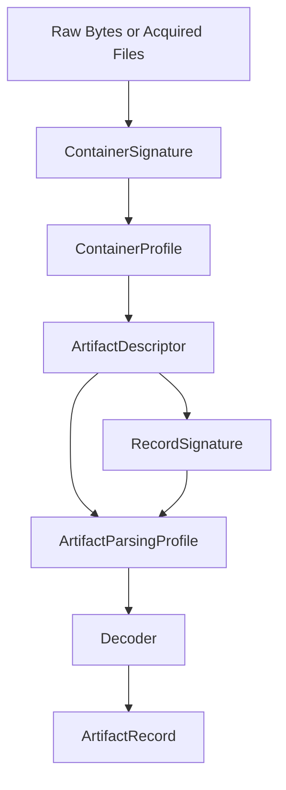

<p align="center">
  <picture>
    <source media="(prefers-color-scheme: dark)" srcset="assets/forensicnomicon-banner-dark.png" />
    
  </picture>
</p>

[](https://crates.io/crates/forensicnomicon)
[](https://docs.rs/forensicnomicon)
[](https://github.com/SecurityRonin/forensicnomicon/actions/workflows/ci.yml)
[](LICENSE)
[](https://www.rust-lang.org)
[](https://github.com/sponsors/h4x0r)

**Stop hardcoding artifact paths and MITRE tags into your DFIR tool.**

**6,548 forensic artifacts** — registry keys, files, event logs, memory regions — each with a decoder, MITRE ATT&CK mapping, triage priority, Sigma/KAPE/Velociraptor cross-references, and source citations. Embed it all in one line.

```toml
[dependencies]
forensicnomicon = "0.1"
```

Zero dependencies. No I/O. Everything lives in `const`/`static` memory.

---

## See it in 30 seconds

```rust
use forensicnomicon::ports::is_suspicious_port;
use forensicnomicon::catalog::{CATALOG, TriagePriority};

// Boolean port check — no allocations
assert!(is_suspicious_port(4444)); // Metasploit default

// What to look at first — Critical artifacts, ordered by triage priority
let critical = CATALOG
    .for_triage()
    .into_iter()
    .filter(|d| d.triage_priority == TriagePriority::Critical)
    .collect::<Vec<_>>();
```

If that looks useful, keep reading.

---

## Why use this instead of rolling your own?

Every DFIR tool eventually accumulates a hand-rolled list of artifact paths, MITRE tags, and triage rules scattered across constants, comments, and config files. That list drifts, goes uncited, and becomes a maintenance burden.

`forensicnomicon` is that list, structured:

- Each artifact has a **known location** (hive, key path, file path), a **decoder**, a **triage priority**, and **authoritative source URLs** — all in one `const`-constructible struct
- The catalog is **queryable** — by MITRE technique, triage priority, keyword, or structured filter
- **Cross-referenced** — Sigma rules, KAPE targets, Velociraptor artifacts, STIX patterns, YARA templates, and investigation playbooks all resolve from the same artifact ID
- **Zero deps** — no supply-chain risk, embeds in any binary

---

## What's in the catalog

**6,548 artifacts** across Windows, Linux, macOS, and cloud environments — 361 fully hand-curated entries (with decoders, MITRE tags, triage priorities, and investigator caveats) plus 6,187 generated from seven authoritative DFIR source corpora.

### Curated entries (361)

These carry the most metadata: decoded field schemas, `related_artifacts`, `retention`, and analyst-written `meaning` strings.

**Execution evidence** — UserAssist (ROT13 decoded), Prefetch, Shimcache / AppCompatCache, Amcache, BAM/DAM, MUICache, SRUM database, AppShim, Windows Timeline, Background Activity Moderator

**Persistence** — Run / RunOnce keys (HKLM + HKCU), Scheduled tasks, Startup folders, Active Setup, IFEO debugger hijacking, AppInit DLLs, Logon scripts, WMI subscriptions and MOF files, Services ImagePath, Boot Execute, Print monitors, Time providers, LSA authentication / security / notification packages, Browser Helper Objects, COM hijacking (HKCU), Winlogon shell/userinit, Screensaver executable, Netsh helper DLLs, Password filter DLLs, services HKLM root

**Registry MRU and shell history** — ShellBags, Jump Lists, LNK files, OpenSave MRU, LastVisited MRU, Run MRU, TypedURLs, TypedPaths, WordWheelQuery, MRU Recent Documents

**File system** — `$MFT`, USN Journal, Recycle Bin, Thumbcache, Windows Search database

**Windows Event Logs** — Security, System, PowerShell/ScriptBlock (4104), Sysmon, and 22 additional named channels (RDP client/inbound/session, WinRM, WMI activity, Defender, BITS client, Code Integrity, AppLocker, Firewall, NTLM, SMB, PowerShell Classic, Task Scheduler)

**Credential artifacts** — SAM hive, LSA secrets, DPAPI master keys, DPAPI credential files, Windows Credential Manager vaults, Windows Hello / NGC keys, certificate stores, WDIGEST caching policy, DCC2 / MSCachev2

**Network and remote access** — RDP bitmap cache, RDP client server history, VPN / RAS phonebook, WinSCP sessions, PuTTY sessions and host keys, WiFi profiles, WinSock LSP, NetworkList profiles, MountPoints2, MountedDevices, portable devices

**Cloud, browser, and third-party** — Chrome, Edge, Firefox credential stores; RAT/RMM (TeamViewer, AnyDesk, ScreenConnect, RustDesk); cloud sync (OneDrive, Dropbox, Google Drive FS, MEGAsync); communications (Teams, Slack, Discord, Signal); WinRAR history

**Active Directory** — `NTDS.dit`, SYSTEM boot key (for NTDS decryption), DPAPI SYSTEM master key

**Database artifacts** — BITS job database, hiberfil.sys, pagefile.sys, SRUM sub-tables

**Memory forensics** — Running processes, network connections, loaded modules, in-memory registry hives, LSASS credential material

**macOS** — LaunchAgents (user + system), LaunchDaemons, emond, Unified Log, CoreAnalytics, KnowledgeC, Keychain, TCC database, Quarantine Events, Safari history/downloads, Gatekeeper history, bash/zsh sessions

**Linux** — bash/zsh history, cron jobs, systemd units and timers, XDG autostart, SSH keys and authorized_keys, sshd_config, sudoers, `/etc/passwd` and shadow, auth.log, systemd journal, wtmp/btmp/utmp/lastlog, ld.so.preload, PAM, udev rules, NetworkManager dispatcher, cloud credentials (AWS, Azure, GCP, Kubernetes), Docker config, GPG keys, GNOME Keyring, KDE KWallet, git credentials, netrc

### Generated entries (6,187)

Produced by the `crates/ingest` pipeline — each entry has a location, decoder, OS scope, and source citation.

| Source | Entries | Coverage |
|--------|---------|----------|
| KAPE targets (`EricZimmerman/KapeFiles`) | 2,422 | File and directory collection targets across ~500 `.tkape` files |
| ForensicArtifacts YAML (`forensicartifacts/artifacts`) | 2,545 | Registry keys, files, and directories from the open artifact corpus |
| EVTX / ETW channels (`nasbench/EVTX-ETW-Resources`) | 995 | Every Windows ETW provider channel with a recorded event |
| Velociraptor artifacts (`Velocidex/velociraptor`) | 122 | Registry and file paths extracted from Velociraptor artifact YAML parameters |
| RECmd batch files (`EricZimmerman/RECmd`) | 44 | Registry keys from `RECmd_Batch_MC.reb` and `Kroll_Batch.reb` |
| Browser artifacts (static, 20 browsers) | 37 | History, cookies, logins, and profile dirs for Chrome, Edge, Firefox, Brave, Opera, Vivaldi, Safari, IE, Tor, and others |
| NirSoft tools (static) | 22 | Forensically significant paths documented by NirSoft utilities |

---

## Decode a raw artifact

```rust
use forensicnomicon::catalog::CATALOG;

let d = CATALOG.by_id("userassist_exe").unwrap();
let record = CATALOG.decode(d, value_name, raw_bytes)?;

// record.fields      — Vec<(&str, ArtifactValue)>: typed field pairs
// record.timestamp   — Option<String>: ISO 8601 UTC when present
// record.uid         — stable unique ID built from key fields
```

Built-in decoders: `Rot13Name` (UserAssist), `FiletimeAt` (FILETIME → ISO 8601), `BinaryRecord`, `MruListEx`, `MultiSz`, `Utf16Le`.

---

## Query the catalog

```rust
// All artifacts relevant to a MITRE technique
let hits = CATALOG.by_mitre("T1547.001");

// Triage-ordered list — Critical first
let ordered = CATALOG.for_triage();

// Keyword search across name and meaning
let hits = CATALOG.filter_by_keyword("prefetch");

// Structured filter
use forensicnomicon::catalog::{ArtifactQuery, DataScope, HiveTarget};
let hits = CATALOG.filter(&ArtifactQuery {
    scope: Some(DataScope::User),
    hive: Some(HiveTarget::NtUser),
    ..Default::default()
});
```

---

## Investigation playbooks

Six directed investigation paths — given a trigger artifact or technique, get an ordered list of what to examine next:

```rust
use forensicnomicon::playbooks::{PLAYBOOKS, playbook_by_id, playbooks_for_artifact};

// "I found a suspicious scheduled task — what else should I look at?"
let path = playbook_by_id("persistence_hunt").unwrap();
for step in path.steps {
    println!("{}: {}", step.artifact_id, step.rationale);
    println!("  Look for: {}", step.look_for);
}

// Find all playbooks that reference an artifact
let relevant = playbooks_for_artifact("evtx_security");
```

Available playbooks: `lateral_movement_rdp`, `credential_harvesting`, `persistence_hunt`, `data_exfiltration`, `execution_trace`, `defense_evasion`.

---

## Toolchain cross-references

Map any artifact ID to KAPE targets and Velociraptor artifacts:

```rust
use forensicnomicon::toolchain::{kape_mapping_for, kape_target_set, velociraptor_artifact_set};

// Single artifact
let m = kape_mapping_for("prefetch_dir").unwrap();
// m.kape_targets              — &["Prefetch", "!BasicCollection"]
// m.velociraptor_artifacts    — &["Windows.Forensics.Prefetch"]

// Build a deduplicated collection plan for multiple artifacts
let targets = kape_target_set(&["evtx_security", "mft_file", "prefetch_dir"]);
let velo    = velociraptor_artifact_set(&["evtx_security", "mft_file"]);
```

---

## Detection engineering integration

```rust
// Sigma rules for an artifact
use forensicnomicon::sigma::sigma_refs_for;
let rules = sigma_refs_for("evtx_security");
// rules[0].rule_id, rules[0].title, rules[0].mitre_techniques

// YARA skeleton
use forensicnomicon::yara::yara_rule_template;
let rule = yara_rule_template("prefetch_dir").unwrap();

// ATT&CK Navigator layer (JSON)
use forensicnomicon::navigator::generate_navigator_layer;
let json = generate_navigator_layer("My Hunt");

// STIX 2.1 observable pattern
use forensicnomicon::stix::stix_mapping_for;
let stix = stix_mapping_for("userassist_exe").unwrap();
// stix.stix_pattern — Some("[windows-registry-key:key = '...']")
```

---

## Evidence and volatility

```rust
use forensicnomicon::evidence::{evidence_for, EvidenceStrength};
use forensicnomicon::volatility::{volatility_for, acquisition_order};

// How reliable is this artifact as evidence?
let e = evidence_for("prefetch_dir").unwrap();
// e.strength — EvidenceStrength::Strong
// e.caveats  — &["Disabled by default on Server SKUs", ...]

// RFC 3227 acquisition order — most volatile first
let order = acquisition_order();
// order[0] → mem_running_processes (Volatile)
// order[n] → mft_file (Persistent)
```

---

## Indicator tables

Thirteen flat lookup modules — no schema, no decoder, just fast boolean checks:

```rust
use forensicnomicon::{
    ports::is_suspicious_port,
    lolbins::is_windows_lolbin,
    processes::MALWARE_PROCESS_NAMES,
    persistence::WINDOWS_RUN_KEYS,
    remote_access::is_lolrmm_path,
    third_party::identify_application,
};
```

<details>
<summary>Full module list</summary>

| Module | Covers | Key API |
|---|---|---|
| `ports` | C2, Cobalt Strike, Tor, WinRM, RAT defaults | `is_suspicious_port(u16)` |
| `lolbins` | Windows LOLBAS + Linux GTFOBins | `is_windows_lolbin(&str)`, `is_linux_lolbin(&str)` |
| `processes` | Known malware / masquerade process names | `MALWARE_PROCESS_NAMES` |
| `commands` | Log-wipe commands, rootkit names | pattern slices |
| `paths` | Suspicious staging and hijack paths | path slices |
| `persistence` | Run keys, cron/init, LaunchAgents, IFEO, AppInit | `WINDOWS_RUN_KEYS`, `LINUX_PERSISTENCE_PATHS` |
| `antiforensics` | Log-wipe, timestomping, rootkit indicators | indicator slices |
| `antiforensics_aware` | Per-artifact anti-forensic risk model | `anti_forensics_for(&str)`, `artifacts_vulnerable_to(technique)` |
| `encryption` | BitLocker, EFS, VeraCrypt, Tor, archive tools | path slices |
| `remote_access` | LOLRMM / RMM tool indicators | `all_lolrmm_paths()`, `is_lolrmm_path(&str)` |
| `third_party` | PuTTY, WinSCP, OneDrive, Chrome, Dropbox | `identify_application(&str)` |
| `pca` | Windows 11 Program Compatibility Assistant | path / key constants |
| `references` | Queryable source map per module | `module_references(name)` |

</details>

---

## Cross-reference modules

| Module | What it provides | Key API |
|---|---|---|
| `chainsaw` | Chainsaw / Hayabusa hunt rule references | `hunt_rules_for(&str)`, `rules_for_tool(HuntTool)` |
| `dependencies` | Artifact dependency graph | `dependencies_of(&str)`, `full_collection_set(&[&str])` |
| `eventids` | Windows Event ID enrichment | `event_entry(u32)`, `events_for_artifact(&str)` |
| `evidence` | Evidence strength / reliability ratings | `evidence_for(&str)`, `artifacts_with_strength(min)` |
| `forensicartifacts` | ForensicArtifacts.com YAML interop | `fa_ref_for(&str)`, `to_fa_yaml(&str)` |
| `navigator` | ATT&CK Navigator JSON layer | `generate_navigator_layer(&str)` |
| `playbooks` | Directed investigation paths | `playbook_by_id(&str)`, `playbooks_for_artifact(&str)` |
| `plugin` | Runtime decoder plugin architecture | `ExtendedCatalog`, `CustomDecoder` trait |
| `sigma` | Sigma rule cross-references | `sigma_refs_for(&str)` |
| `stix` | STIX 2.1 observable mappings | `stix_mapping_for(&str)` |
| `temporal` | Temporal correlation hints | `temporal_hints_for(&str)` |
| `toolchain` | KAPE / Velociraptor mappings | `kape_mapping_for(&str)`, `kape_target_set(&[&str])` |
| `version_history` | OS version artifact change tracking | `version_history_for(&str)` |
| `volatility` | RFC 3227 Order of Volatility | `volatility_for(&str)`, `acquisition_order()` |
| `yara` | YARA rule template generator | `yara_rule_template(&str)` |

---

<details>
<summary>ArtifactDescriptor — full field reference</summary>

Every entry in `CATALOG` is a `const`-constructible `ArtifactDescriptor`:

| Field | Type | Description |
|---|---|---|
| `id` | `&'static str` | Machine-readable identifier, e.g. `"userassist_exe"` |
| `name` | `&'static str` | Human-readable display name |
| `artifact_type` | `ArtifactType` | `RegistryKey`, `RegistryValue`, `File`, `Directory`, `EventLog`, `MemoryRegion` |
| `hive` | `Option<HiveTarget>` | Registry hive, or `None` for file/memory artifacts |
| `key_path` | `&'static str` | Path relative to hive root |
| `file_path` | `Option<&'static str>` | Absolute file path where applicable |
| `scope` | `DataScope` | `User`, `System`, `Network`, `Mixed` |
| `os_scope` | `OsScope` | `Win10Plus`, `Linux`, `LinuxSystemd`, `MacOS`, `MacOS12Plus`, … |
| `decoder` | `Decoder` | `Identity`, `Rot13Name`, `FiletimeAt`, `BinaryRecord`, `Utf16Le`, … |
| `meaning` | `&'static str` | Forensic significance |
| `mitre_techniques` | `&'static [&'static str]` | ATT&CK technique IDs |
| `fields` | `&'static [FieldSchema]` | Decoded output field schema |
| `retention` | `Option<&'static str>` | How long the artifact typically persists |
| `triage_priority` | `TriagePriority` | `Critical` / `High` / `Medium` / `Low` |
| `related_artifacts` | `&'static [&'static str]` | Cross-correlation artifact IDs |
| `sources` | `&'static [&'static str]` | Authoritative source URLs |

</details>

---

<details>
<summary>Parsing stack and scope boundary</summary>

This crate is a **forensic catalog**, not a full parsing engine. Compact stable transforms (UserAssist ROT13, FILETIME, MRU ordering) live in-core. Large evolving parsers (hiberfil.sys, full WMI repository, BITS job store) belong in separate companion crates.

Parsing knowledge is layered:



All layers are queryable via `CATALOG`:

```rust
let cp  = CATALOG.container_profile("windows_registry_hive");
let cs  = CATALOG.container_signature("windows_registry_hive");
let pp  = CATALOG.parsing_profile("userassist_exe");
let rs  = CATALOG.record_signatures("userassist_exe");
```

</details>

---

## `fnomicon` CLI

A companion CLI binary for interactive catalog exploration:

```
$ cargo install --path crates/fcatalog
$ fnomicon list
$ fnomicon search prefetch
$ fnomicon show userassist_exe
$ fnomicon triage
```

---

## Mass-import pipeline

The `crates/ingest` binary refreshes the generated entries from upstream sources. Run it when source corpora publish updates:

```bash
cargo run -p ingest -- --source all --output src/catalog/descriptors/generated/
# Review the diff, then commit.
```

Individual sources: `--source kape`, `--source fa`, `--source evtx`, `--source velociraptor`, `--source regedit`, `--source browsers`, `--source nirsoft`.

---

## Feature flags

| Flag | Default | Purpose |
|---|---|---|
| `serde` | off | `Serialize` / `Deserialize` on all public types |

All static indicators and catalog types work without any feature flag. The `serde` feature adds optional serialization at zero runtime cost when unused.

---

## Docs

| | |
|---|---|
| [DFIR Handbook](https://securityronin.github.io/forensicnomicon/forensicnomicon/handbook/) | Artifact families, investigation paths, carving guidance |
| [API Reference](https://docs.rs/forensicnomicon) | Full rustdoc |
| [Architecture Diagram](https://securityronin.github.io/forensicnomicon/architecture.html) | Data-flow: raw bytes → ArtifactRecord |
| [Module Source Map](docs/module-sources.md) | Per-module authoritative references |

---

## Used by

- [`RapidTriage`](https://github.com/SecurityRonin/RapidTriage) — live incident response triage tool
- [`blazehash`](https://github.com/SecurityRonin/blazehash) — high-speed forensic hash verification
