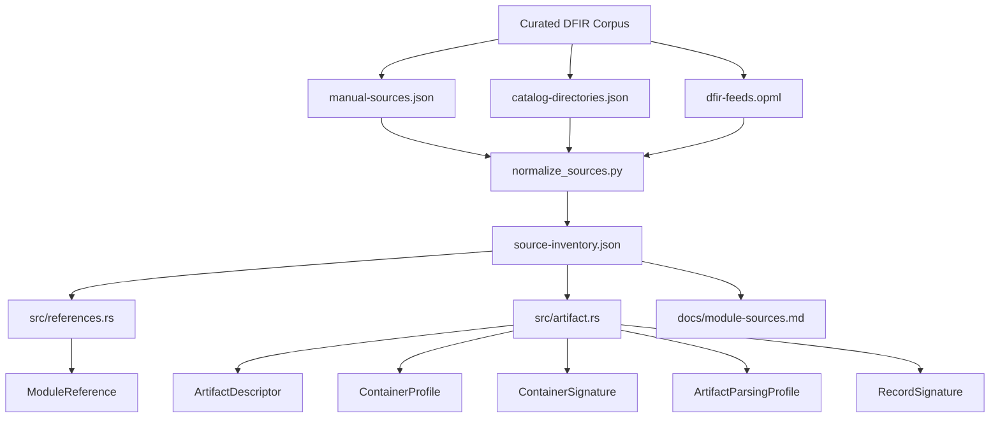
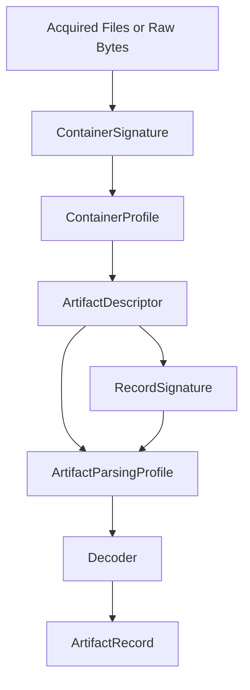
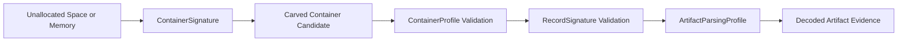

# Module Source Map

This crate has two layers:

- small zero-allocation indicator modules such as `ports`, `lolbins`, and `persistence`
- the larger [`artifact`](../src/artifact.rs) catalog, which models specific artifacts with decode logic, ATT&CK mappings, triage priority, retention, and per-artifact sources

The [`references`](../src/references.rs) module turns module-level provenance into queryable static data.

## Coverage

`artifact`
Unified descriptor registry. Current implementation already carries 151 artifact descriptors with embedded `sources`, `related_artifacts`, decode schemas, and triage ordering. This is the richest part of the crate and the best place to keep growing artifact-specific research.

Authoritative references:
- MITRE ATT&CK: https://attack.mitre.org/
- Harlan Carvey Windows IR: http://windowsir.blogspot.com/
- Eric Zimmerman tool/index docs: https://ericzimmerman.github.io/#!index.md

Expansion targets:
- add more Linux event/log artifacts
- add macOS descriptor parity instead of path-only coverage
- normalize ATT&CK mappings where only parent techniques are present

`ports`
Attacker-favored ports tied to C2, Tor, WinRM, and commodity remote access.

Authoritative references:
- SANS ISC port database: https://isc.sans.edu/port.html
- Microsoft WinRM configuration: https://learn.microsoft.com/en-us/windows/win32/winrm/installation-and-configuration-for-windows-remote-management
- Tor Project port guidance: https://support.torproject.org/tbb/tbb-firewall-ports/

Expansion targets:
- split by confidence or context instead of a single suspicious list
- attach protocol/service rationale for each port

`lolbins`
Windows LOLBAS and Linux GTFOBins coverage for proxy execution and execution chaining.

Authoritative references:
- LOLBAS: https://lolbas-project.github.io/
- GTFOBins: https://gtfobins.github.io/
- MITRE ATT&CK T1218: https://attack.mitre.org/techniques/T1218/

Expansion targets:
- track per-binary ATT&CK sub-techniques
- add execution mode metadata such as download, proxy execution, or UAC bypass

`processes`
Masquerade targets and offensive-tool process names for process tree review.

Authoritative references:
- MITRE ATT&CK T1036: https://attack.mitre.org/techniques/T1036/
- Microsoft svchost reference: https://learn.microsoft.com/en-us/windows/application-management/svchost-service-refactoring
- Microsoft authentication process overview: https://learn.microsoft.com/en-us/windows-server/security/windows-authentication/credentials-processes-in-windows-authentication

Expansion targets:
- distinguish built-in process names from offensive framework names
- add parent/child expectations for high-value Windows processes

`commands`
Reverse shell, PowerShell abuse, and ingress tool transfer pattern sets.

Authoritative references:
- PayloadsAllTheThings reverse shell cheat sheet: https://github.com/swisskyrepo/PayloadsAllTheThings/blob/master/Methodology%20and%20Resources/Reverse%20Shell%20Cheatsheet.md
- MITRE ATT&CK T1059: https://attack.mitre.org/techniques/T1059/
- MITRE ATT&CK T1105: https://attack.mitre.org/techniques/T1105/

Expansion targets:
- separate high-signal patterns from generic admin usage
- add shell family metadata for detection tuning

`paths`
Trusted library locations and suspicious staging paths.

Authoritative references:
- Microsoft file path naming: https://learn.microsoft.com/en-us/windows/win32/fileio/naming-a-file
- Linux FHS 3.0: https://refspecs.linuxfoundation.org/FHS_3.0/fhs/index.html
- MITRE ATT&CK T1574.001: https://attack.mitre.org/techniques/T1574/001/

Expansion targets:
- normalize Windows env-var paths
- add path classification instead of boolean-only helpers

`persistence`
Registry, cron, systemd, launchd, and hijack-based persistence locations.

Authoritative references:
- MITRE ATT&CK T1547: https://attack.mitre.org/techniques/T1547/
- Sysinternals Autoruns: https://learn.microsoft.com/en-us/sysinternals/downloads/autoruns
- Windows IR persistence notes: http://windowsir.blogspot.com/2013/07/howto-detecting-persistence-mechanisms.html

Expansion targets:
- model per-location execution semantics
- add startup-folder and service-file nuance for Linux and macOS

`antiforensics`
Log wiping, rootkit, and timestomping indicators.

Authoritative references:
- MITRE ATT&CK T1070: https://attack.mitre.org/techniques/T1070/
- MITRE ATT&CK T1070.006: https://attack.mitre.org/techniques/T1070/006/
- Windows IR timestomping analysis: http://windowsir.blogspot.com/2023/10/investigating-time-stomping.html

Expansion targets:
- add Linux-specific anti-forensic cleanup artifacts
- separate userland and kernel-level rootkit families

`encryption`
BitLocker, EFS, VeraCrypt, Tor, and archive tool registry evidence.

Authoritative references:
- Microsoft BitLocker policy reference: https://learn.microsoft.com/en-us/windows/security/operating-system-security/data-protection/bitlocker/bitlocker-group-policy-settings
- Microsoft EFS reference: https://learn.microsoft.com/en-us/windows/win32/fileio/file-encryption
- Belkasoft VeraCrypt forensics: https://belkasoft.com/veracrypt-forensics

Expansion targets:
- add file-system level evidence beyond registry paths
- distinguish credential storage from at-rest encryption

`remote_access`
LOLRMM and remote administration product indicators.

Authoritative references:
- LOLRMM: https://lolrmm.io/
- CISA AA23-025A: https://www.cisa.gov/news-events/cybersecurity-advisories/aa23-025a
- Red Canary RMM abuse overview: https://redcanary.com/blog/threat-intelligence/remote-monitoring-management/

Expansion targets:
- map tool vendor, binary names, services, and install paths
- split benign enterprise usage from intrusion-relevant deployment signals

`third_party`
Third-party app registry artifacts for SSH clients, sync tools, and browsers.

Authoritative references:
- PuTTY registry appendix: https://the.earth.li/~sgtatham/putty/0.78/htmldoc/AppendixC.html
- WinSCP registry storage: https://winscp.net/eng/docs/ui_pref_storage
- Chrome enterprise policies: https://chromeenterprise.google/policies/

Expansion targets:
- extend to Firefox, Edge, and additional cloud sync clients
- add saved-credential or recent-connection semantics where appropriate

`pca`
Windows 11 Program Compatibility Assistant execution artifacts.

Authoritative references:
- Andrea Fortuna PCA write-up: https://andreafortuna.org/2024/windows11-pca-artifact/
- MITRE ATT&CK T1204: https://attack.mitre.org/techniques/T1204/

Expansion targets:
- cross-link PCA records with Prefetch, Amcache, and UserAssist
- capture PCA coverage limitations more explicitly in user-facing docs

## Full-Blog Archive

The repository includes [`scripts/archive_blog.py`](../scripts/archive_blog.py), a dependency-free archive tool for building a local source corpus from a DFIR blog.

Recommended target for Windows-focused artifact work:

- Windows Incident Response archive: https://windowsir.blogspot.com/

Why this blog:

- it is already cited repeatedly across the crate
- it spans many years of artifact-focused DFIR research
- archive pages exist by year, and Blogger feeds can be paged for full historical collection

Suggested command:

```bash
python3 scripts/archive_blog.py \
  --url https://windowsir.blogspot.com \
  --output archive/windowsir
```

## Machine-Readable Source Inventory

The authoritative source inventory now lives in machine-readable form under
`archive/sources/`:

- `catalog-directories.json` for directory-style discovery pages such as `aboutDFIR blogs index` and CrowdStrike category pages
- `manual-sources.json` for curated references and knowledge bases that are not just feed subscriptions
- `dfir-feeds.opml` for subscribed RSS/Atom feeds
- `source-inventory.json` for the normalized canonical inventory generated from the three inputs above
- `source-inventory.md` for a readable generated summary of that inventory

This is the stable place to maintain the corpus. Code comments should only keep
the high-level policy and point here, not duplicate the full source list.

## Knowledge Architecture

Maintainers should think about the repo as a pipeline from source corpus to
queryable artifact knowledge, not as a single flat list of references.

### Corpus Pipeline



### Parsing Stack



### Carving Model



### Layer Responsibilities

- `ModuleReference`
  Module-level provenance for small indicator tables and broad catalog coverage.
- `ArtifactDescriptor`
  The authoritative answer to “where does this artifact live and why does it matter?”
- `ContainerProfile`
  The outer parser layer for formats such as Registry hives, SQLite, ESE, EVTX, OLE CFB, and memory-bearing sources.
- `ContainerSignature`
  Carving and recognition guidance for outer containers, including magic bytes, offsets, alignment, and structural invariants.
- `ArtifactParsingProfile`
  Artifact-specific semantics that sit above container parsing, such as `UserAssist` ROT13 or WMI subscription triads.
- `RecordSignature`
  Carving and validation guidance for individual records or payload fragments inside a container.
- `Decoder`
  Small stable transforms that are safe to implement in-core.

### Example: UserAssist

`UserAssist` spans multiple layers and should be maintained that way:

- `ContainerSignature`
  Registry-hive recognition such as `regf` and cell-level signatures like `nk` and `vk`
- `ContainerProfile`
  Open `NTUSER.DAT`, enumerate keys and values, and preserve raw value names plus bytes
- `ArtifactDescriptor`
  Locate `Software\Microsoft\Windows\CurrentVersion\Explorer\UserAssist\{GUID}\Count`
- `ArtifactParsingProfile`
  Decode the value name with ROT13 and interpret the Win7+ Count payload
- `RecordSignature`
  Validate the 72-byte Count payload structure when carving or checking fragments
- `Decoder`
  Execute ROT13 and binary field extraction into a normalized `ArtifactRecord`

## Feed Subscription Model

For catalog pages such as `aboutDFIR`, `aboutDFIR Forensicators of DFIR`, and
`aboutDFIR blogs index`, the practical approach is:

- treat the catalog page as a directory source
- add every listed blog that exposes RSS or Atom to the subscribed feed set
- keep non-feed catalog pages as discovery seeds for manual or future automated expansion

The subscribed feed manifest now lives at:

- [`archive/sources/dfir-feeds.opml`](../archive/sources/dfir-feeds.opml)
- [`archive/sources/catalog-directories.json`](../archive/sources/catalog-directories.json)
- [`archive/sources/manual-sources.json`](../archive/sources/manual-sources.json)
- [`archive/sources/source-inventory.json`](../archive/sources/source-inventory.json)

Periodic updates are handled by:

- [`scripts/normalize_sources.py`](../scripts/normalize_sources.py)
- [`scripts/check_feed_updates.py`](../scripts/check_feed_updates.py)
- [`feed-watch.yml`](../.github/workflows/feed-watch.yml)

The maintenance workflow:

- normalizes directory seeds, feed subscriptions, and manual additions into one canonical inventory
- polls every subscribed RSS/Atom feed
- stores the canonical inventory in `archive/sources/source-inventory.json`
- writes a readable summary to `archive/sources/source-inventory.md`
- stores a compact snapshot in `archive/sources/feed-state.json`
- writes a human-readable delta report to `archive/sources/feed-report.md`
- runs daily in GitHub Actions
- opens a PR when the snapshot changes

This is better than relying only on comments because it gives the repository a
living subscription set that can be reviewed and expanded over time.

## Expanded Source Corpus

The catalog should draw from a broader archival source corpus than a single blog.
These are the higher-value sources to keep in rotation when expanding descriptors.

Primary vendor and project references:

- Microsoft Learn: https://learn.microsoft.com/
- Apple Platform Security / Apple Support: https://support.apple.com/guide/security/welcome/web
- MITRE ATT&CK: https://attack.mitre.org/
- LOLBAS: https://lolbas-project.github.io/
- GTFOBins: https://gtfobins.github.io/
- Sysinternals docs: https://learn.microsoft.com/en-us/sysinternals/
- Eric Zimmerman docs: https://ericzimmerman.github.io/#!index.md
- Velociraptor docs: https://docs.velociraptor.app/
- Tor Project docs: https://support.torproject.org/

Practitioner blogs and archives:

- Windows Incident Response: https://windowsir.blogspot.com/
- dfir.blog: https://dfir.blog/
- Open Source DFIR: https://osdfir.blogspot.com/
- Cyber Triage blog: https://www.cybertriage.com/blog/
- SANS blog, DFIR subset: https://www.sans.org/blog/
- DFIR Training blog: https://www.dfir.training/blog/
- Magnet Forensics blog: https://www.magnetforensics.com/blog/
- Forensic Focus articles: https://www.forensicfocus.com/articles/
- HECF / Forensic Lunch archive: https://www.hecfblog.com/
- aboutDFIR: https://aboutdfir.com/
- aboutDFIR Forensicators of DFIR: https://aboutdfir.com/the-community/forensicators-of-dfir/
- aboutDFIR blogs index: https://aboutdfir.com/reading/blogs/
- Binary Foray: https://binaryforay.blogspot.com/
- The DFIR Report: https://thedfirreport.com/

GitHub knowledge bases and living notes:

- Blue Team Hunting Field Notes: https://github.com/bitbug0x55AA/Blue_Team_Hunting_Field_Notes
- regipy: https://github.com/mkorman90/regipy
- Eric Zimmerman evtx: https://github.com/EricZimmerman/evtx
- Eric Zimmerman RECmd: https://github.com/EricZimmerman/RECmd
- Eric Zimmerman RegistryPlugins: https://github.com/EricZimmerman/RegistryPlugins
- Eric Zimmerman Registry: https://github.com/EricZimmerman/Registry
- Eric Zimmerman MFTECmd: https://github.com/EricZimmerman/MFTECmd
- Eric Zimmerman JLECmd: https://github.com/EricZimmerman/JLECmd
- Eric Zimmerman JumpList: https://github.com/EricZimmerman/JumpList
- Eric Zimmerman LECmd: https://github.com/EricZimmerman/LECmd
- Eric Zimmerman Lnk: https://github.com/EricZimmerman/Lnk
- Eric Zimmerman PECmd: https://github.com/EricZimmerman/PECmd
- Eric Zimmerman Prefetch: https://github.com/EricZimmerman/Prefetch
- Eric Zimmerman AppCompatCacheParser: https://github.com/EricZimmerman/AppCompatCacheParser
- Eric Zimmerman AmcacheParser: https://github.com/EricZimmerman/AmcacheParser
- Eric Zimmerman Srum: https://github.com/EricZimmerman/Srum
- Eric Zimmerman RBCmd: https://github.com/EricZimmerman/RBCmd
- Eric Zimmerman SQLECmd: https://github.com/EricZimmerman/SQLECmd
- Eric Zimmerman WxTCmd: https://github.com/EricZimmerman/WxTCmd
- Eric Zimmerman OleCf: https://github.com/EricZimmerman/OleCf
- Eric Zimmerman MFT: https://github.com/EricZimmerman/MFT
- Eric Zimmerman RecentFileCacheParser: https://github.com/EricZimmerman/RecentFileCacheParser
- Eric Zimmerman WinSearchDBAnalyzer: https://github.com/EricZimmerman/WinSearchDBAnalyzer
- Eric Zimmerman USBDevices: https://github.com/EricZimmerman/USBDevices
- Eric Zimmerman ExtensionBlocks: https://github.com/EricZimmerman/ExtensionBlocks
- Eric Zimmerman GuidMapping: https://github.com/EricZimmerman/GuidMapping
- Eric Zimmerman DFIR-SQL-Query-Repo: https://github.com/EricZimmerman/DFIR-SQL-Query-Repo
- Eric Zimmerman RegistryExplorerBookmarks: https://github.com/EricZimmerman/RegistryExplorerBookmarks
- Eric Zimmerman TLEFilePlugins: https://github.com/EricZimmerman/TLEFilePlugins
- Eric Zimmerman KapeFiles: https://github.com/EricZimmerman/KapeFiles
- Eric Zimmerman KapeDocs: https://github.com/EricZimmerman/KapeDocs
- Eric Zimmerman documentation: https://github.com/EricZimmerman/documentation
- Eric Zimmerman Get-ZimmermanTools: https://github.com/EricZimmerman/Get-ZimmermanTools
- SigmaHQ: https://github.com/SigmaHQ/sigma
- Hayabusa rules: https://github.com/Yamato-Security/hayabusa-rules
- Chainsaw rules and detections: https://github.com/WithSecureLabs/chainsaw

Use hierarchy:

- prefer primary platform or tool documentation first
- use long-form practitioner writeups for artifact nuance, parser caveats, and retention behavior
- use GitHub field notes and rule corpora for hunting pivots, log coverage, and cross-checking investigator assumptions

## Additional Practitioner Blogs

These are subscribed in [`archive/sources/dfir-feeds.opml`](../archive/sources/dfir-feeds.opml) and are useful as secondary research sources when expanding artifact coverage:

- az4n6 (Paul Rascagneres): https://az4n6.blogspot.com/
- DFIR Diva: https://dfirdiva.com
- Digital Forensics Stream: https://df-stream.com
- mac4n6 (Sarah Edwards): https://www.mac4n6.com/
- Salt Forensics: https://salt4n6.com/
- Cheeky4n6Monkey: http://cheeky4n6monkey.blogspot.com/
- ThinkDFIR: https://thinkdfir.com/
- DoubleBlak: https://www.doubleblak.com/
- The Binary Hick: https://thebinaryhick.blog/
- forensicmike1: https://forensicmike1.com/
- tisiphone.net: https://tisiphone.net/
- Smarter Forensics: https://smarterforensics.com/
- Initialization Vectors: https://abrignoni.blogspot.com/
- Brett Shavers: https://brettshavers.com/brett-s-blog
- Yogesh Khatri's forensic blog: http://www.swiftforensics.com/
- Forensic Focus: https://www.forensicfocus.com/
- Forensic 4cast: https://forensic4cast.com/
- This Week In 4n6: https://thisweekin4n6.com/
- Cellebrite blog: https://cellebrite.com/en/blog/
- Magnet Forensics blog: https://www.magnetforensics.com/blog/
- DFIR Training: https://www.dfir.training/
- Amped Software blog: https://blog.ampedsoftware.com/

For catalog entries, prefer:

- platform and tool docs first
- deep DFIR practitioner blogs second
- broader security blogs only when they provide unique incident or tradecraft detail directly relevant to the artifact
